# NYC Taxi Data Engineering: End-to-End Microsoft Fabric Solution

## Project Overview
This repository implements a scalable data engineering pipeline designed to process and analyze over **9.3 million records** of New York City Taxi trip data. Built entirely on the **Microsoft Fabric** ecosystem using **PySpark**, the solution covers the full data lifecycle: from automated ingestion and multi-layer cleaning to dimensional modeling. The final output is a Power BI report leveraging **Direct Lake** mode, providing high-performance analytics by reading Delta tables directly from OneLake without data duplication.

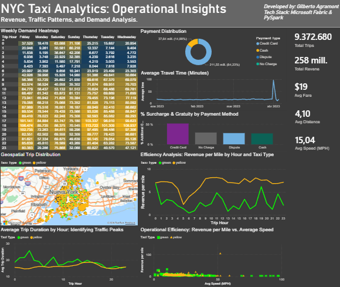

---

## Tech Stack
* **Orchestration:** Azure Data Factory (Fabric Pipelines)
* **Processing:** Apache Spark (PySpark) 
* **Storage:** Azure Data Lake Gen2 with Delta Lake format
* **Modeling:** Star Schema
* **Optimization:** Z-ORDER Clustering & V-Order
* **Reporting:** Power BI (Direct Lake mode)

---

## Architecture
The system follows a **Medallion Architecture** (Bronze, Silver, Gold). This approach ensures that data is incrementally refined from raw, immutable files to cleaned transformation layers and, finally, to business-ready analytical models.


The Microsoft Fabric workspace provides the integrated environment for managing the data pipeline, notebooks, and lakehouse assets:

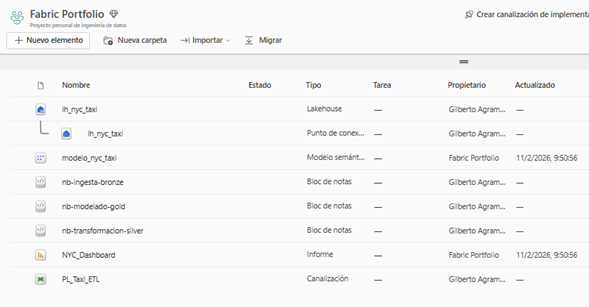

---

## Data Modeling & Semantic Layer

### Star Schema
To ensure fast query response times in Power BI, the Gold layer is structured as a Star Schema. This design minimizes join complexity during analysis and allows the Fabric SQL engine to aggregate millions of rows efficiently.

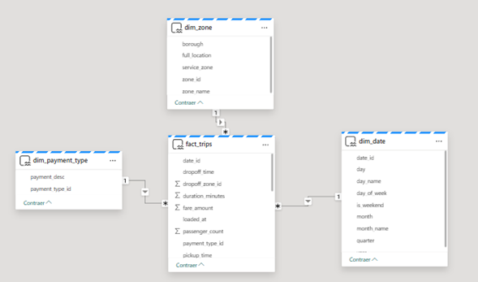

* **Fact Table:** `fact_trips` Partitioned by date
* **Dimensions:** `dim_date`, `dim_zone`, `dim_payment_type`

### Business Logic (DAX)
Core business logic and KPIs, such as **Revenue per Mile** and **Average Speed**, are encapsulated within the Semantic Layer using DAX. This centralizes the calculation logic, ensuring consistency across all report views.

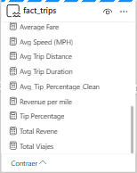

---

## Lakehouse Storage Structure
Physical data organization is managed within a Fabric Lakehouse. I maintained a strict separation between the file based landing zone and the managed Delta tables to support both data science and BI workloads.

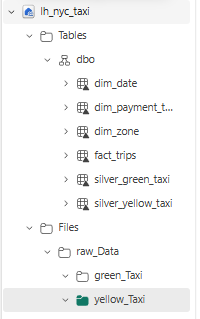

* **Files (Bronze Layer):** Raw Parquet files stored in a hierarchical folder structure.
* **Tables (Silver & Gold Layers):** Managed Delta Tables optimized for high-concurrency reading.

---

## Orchestration: Metadata Driven Pipeline
The ETL process is fully automated and metadata driven. Instead of hardcoding separate flows for Yellow and Green taxi data, I implemented a **Dynamic Parameterized Pattern**. This allowed me to process multiple datasets using a single and reusable pipeline logic.

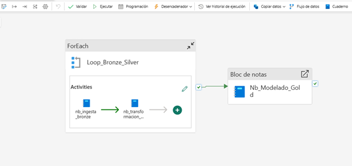

### 1. Configuration Array
The pipeline is triggered by a JSON Array parameter that defines the specific batches (Taxi Type and Date) to be processed.
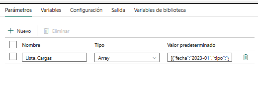

### 2. Iteration Logic
A ForEach activity iterates through the array, triggering parallel notebook executions to optimize processing time.
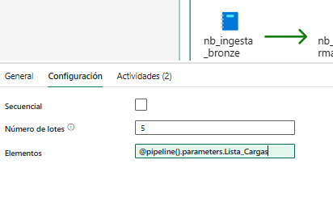

### 3. Context Injection
Using dynamic expressions, the pipeline injects context-specific variables directly into the Spark Notebook's parameter cells at runtime.
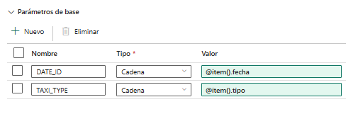

---

## Code Implementation Details

### Incremental Loading (SCD Type 1)
To prevent data duplication during re-runs, the Silver layer utilizes Delta Lake's "MERGE" operation. This ensures that the pipeline is idempotent and it updates existing records and inserts new ones based on a unique "trip_id".

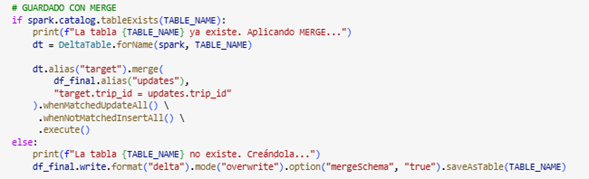

### Schema Normalization & Robustness
Different taxi providers often have slight schema variations. The transformation logic dynamically standardizes these differences into a unified Silver schema, making the pipeline robust against schema drift.

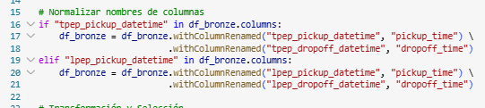

### Storage Optimization (z-ORDER)
To minimize latency for geospatial queries, Gold tables are optimized using **z-Order Clustering** on the 'pickup_zone_id'. This physically rearranges the data in storage to allow Spark to skip irrelevant file blocks, significantly speeding up the dashboard filters.

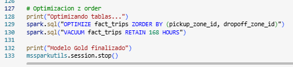

### Geospatial Data Enrichment
During the visualization phase, I identified that generic location names caused geocoding ambiguities in Azure Maps, occasionally placing data points in incorrect international locations. To resolve this, I implemented a transformation in the Gold layer to concatenate specific geographic context to each zone name, ensuring accurate rendering within New York City.

```python
# Enriching location names for accurate geocoding
df_zone = df_zone.withColumn("full_location", concat(col("zone_name"), lit(", New York, NY, USA")))
```
---

## Repository Structure
* `src/`: PySpark Notebooks for Bronze, Silver, and Gold layers.
* `reports/`: Power BI file optimized for Direct Lake and its PDF.
* `assets/`: Project documentation, diagrams, and evidence.

---
**Developed by Gilberto Agramont** [](https://www.linkedin.com/in/gilberto-agramont-cloud/)